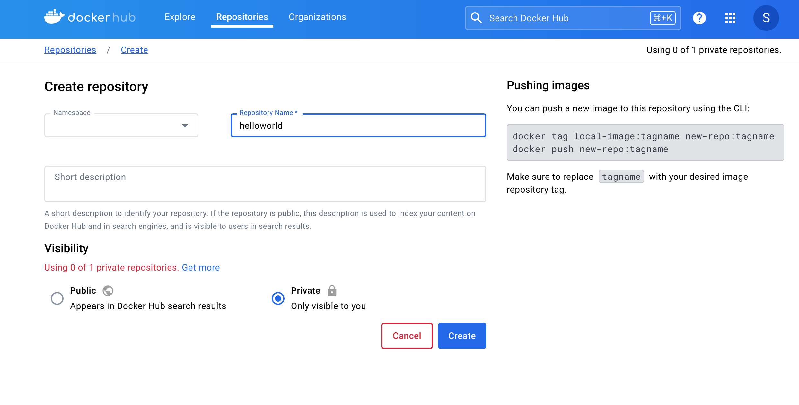

# Übung 4

**Hinweise:**

In den Aufgaben 2 bis 6 dieser Übung verwenden wir Docker um Anwendungen zu containerisieren und zu nutzen. Hierzu können Sie Docker Desktop installieren: [https://www.docker.com/products/docker-desktop/](https://www.docker.com/products/docker-desktop/). Hier finden Sie eine Übersicht der verschiedenen Docker-Befehle: [https://docs.docker.com/reference/cli/docker/](https://docs.docker.com/reference/cli/docker/)  

Anmerkung: Starten Sie Docker einmal und gehen Sie in die Einstellungen. Hier können Sie schon mal den Haken bei "Enable Kubernetes" setzen (das brauchen wir zwar jetzt noch nicht, aber zu einem späteren Zeitpunkt).

Jede der folgenden Aufgaben sollte in einem eigenen Projekt realisiert werden.   

Zunächst einmal können Sie das Repository zu Übung 4 über git klonen.  

In diesem Repository finden sie Dockerfiles, die nach folgendem Schema aufgebaut sind:

   ```bash
Dockerfile_n
   ```
Das n ist jeweils eine Ziffer (1,2,3, ...), welche die zugehörige Aufgabe referenziert. Um die Datei in dem jeweiligen Projekt/Repository nutzen zu können, müssen Sie sie folgendermaßen umbenennen:

   ```bash
Dockerfile
   ```

**Aufgabe 1 - Eine Python-App in der Google App Engine realisieren**

Hinweis: Diese Übung ist freiwillig! Sie erfordert zumindest das Anlegen eines kostenlosen Testaccounts unter https://cloud.google.com/. Selbst der kostenlose Test-Account erfordert jedoch die Angabe von z. B. Kreditkarteninformationen. Es liegt in ihrem eigenen Ermessen, ob Sie entsprechende Angaben machen möchten. Wichtig ist in jedem Fall, die angelegten Ressourcen wieder zu löschen (wie, das wird in dieser Anleitung erklärt). Die Verwendung der entsprechenden Dienste erfolgt jedoch unter eigener Verantwortung!

Anmerkung: Wir nutzen hier ein Angebot der Google Cloud exemplarisch. Dies lässt sich bei anderen Cloud-Providern wie AWS, Azure, IBM etc. in ähnlicher Weise nutzen.

Unter folgendem Link finden Sie ein Tutorial, um eine einfache Python-App in der Google App Engine zu realisieren: [https://codelabs.developers.google.com/codelabs/cloud-app-engine-python3#0](https://codelabs.developers.google.com/codelabs/cloud-app-engine-python3#0) 

Anmerkung: Im Tutorial fehlt leider der Hinweis, dass die App Engine Administratorrechte wie untenstehend aktiviert sein müssen. Aktivieren Sie sie zunächst und folgen Sie dann den Anweisungen im Tutorial.


**Wichtig:**
Vergessen Sie nicht am Ende des Tutorials die Ressourcen wieder zu bereinigen, die Sie angelegt haben:


**Aufgabe 2 - Eine Python-App mit Docker containerisieren**

Klonen Sie das Repository zu dieser Übung.  

Erstellen Sie einen Ordner mit folgenden Dateien:

- app.py
- requirements.txt
- Dockerfile (zur Aufgabe 2, siehe Umbenennung oben)

Starten Sie Docker.

Erzeugen Sie ein Docker-Image:

   ```bash
docker build -t wikisearch .
   ```

Starten Sie den Container:
   ```bash
docker run -p 8888:80 wikisearch
   ```
Rufen Sie in ihrem Browser folgende Adresse auf:
   ```bash
http://localhost:8888?wiki=Nürnberg
   ```
Sie sollten nun eine kurze Zusammenfassung zur Stadt Nürnberg sehen.  

Probieren Sie das auch mit anderen Städtenamen aus.  

Prüfen Sie im Docker-Desktop-Dashboard ob der Container läuft.

Prüfen Sie über die Kommandozeile, ob der Container läuft:

   ```bash
docker ps -a

   ```
Quizfrage: Wie vergibt Docker die Default-Namen für seine Container?

Stoppen Sie den Container über das Dashboard oder über die Kommandozeile mit:
   ```bash
docker stop [container_name]

   ```
Finden Sie heraus, wie man einem Container einen selbstgewählten Namen geben kann und starten Sie ihn noch einmal mit einem selbst gewählten Namen.  

Stoppen Sie den Container wie oben angegeben.


**Aufgabe 3 - Eine Java-App mit Docker containerisieren**

Stellen  Sie sicher, dass Sie ein Java Development Kit (JDK) installiert haben [https://www.oracle.com/de/java/technologies/downloads/](https://www.oracle.com/de/java/technologies/downloads/).

Erstellen Sie einen Ordner mit folgenden Dateien:

- HelloWorld.java
- Dockerfile (zur Aufgabe 3, siehe Umbenennung oben)

Erzeugen Sie ein Docker-Image:
   ```bash
docker build -t hello-world-java .
   ```
Starten Sie den Container mit:
   ```bash
docker run hello-world-java

   ```
Prüfen Sie ob der Container läuft. Was ist der Unterschied zu Aufgabe 2?

**Aufgabe 4 - Eine eigene App mit Docker containerisieren und ausführen**

Schreiben Sie ein Programm ihrer Wahl (und ein zugehöriges Dockerfile), dass Sie containerisieren und ausführen.  


**Aufgabe 5 - Den Nginx-Webserver als Docker Image nutzen**

Legen Sie sich einen Account auf [Docker Hub](https://hub.docker.com/) an.  

Ziehen Sie sich das Image des nginx-Webservers:
   ```bash
docker pull nginx
   ```
Starten Sie den Webserver mit:
   ```bash
docker run --name some-nginx -d -p 8080:80 nginx
   ```
Öffnen Sie ihren Browser. Unter folgender Adresse sollten Sie die Startseite des Webservers sehen:
   ```bash
http://localhost:8080
   ```
Stoppen Sie den Container.  

Folgendermaßen können Sie sich die vorhandenen Docker-Images mit ihrer zugehörigen ID anzeigen lassen:
   ```bash
docker images
   ```
Löschen Sie das Image des nginx-Servers wieder mit:
   ```bash
docker rmi [Image-ID]
   ```
bzw. mit
   ```bash
docker rmi -f [Image-ID]
   ```

**Aufgabe 6 - Ein eigenes Docker-Image auf Docker Hub pushen und pullen**

Erstellen Sie auf Docker Hub ein Repository, auf das Sie das Image pushen können:


Öffnen Sie ein Terminal und lassen Sie sich ggf. ihre lokal vorhandenen Docker-Images anzeigen. Das Image, das sie pushen möchten, müssen sie zunächst wie im folgenden Beispiel taggen:
   ```bash
docker tag local-image-id yourusername/myrepo:latest
   ```
Hierbei ist local-image-id die ID ihres lokalen Docker-Images, yourusername ihr Benutzername und myrepo der Name des Repositories, das Sie angelegt haben.  

Loggen Sie sich nun im Terminal ein mit:
   ```bash
docker login
   ```

Jetzt können Sie das Image pushen mit:
   ```bash
docker push yourusername/myrepo:latest
   ```
Überprüfen Sie, ob das Image hochgeladen wurde.  

Anschließend können Sie das Image pullen mit:
   ```bash
docker pull yourusername/myrepo:latest
   ```
Und so können Sie den Container dann starten:
   ```bash
docker run yourusername/myrepo:latest
   ```

