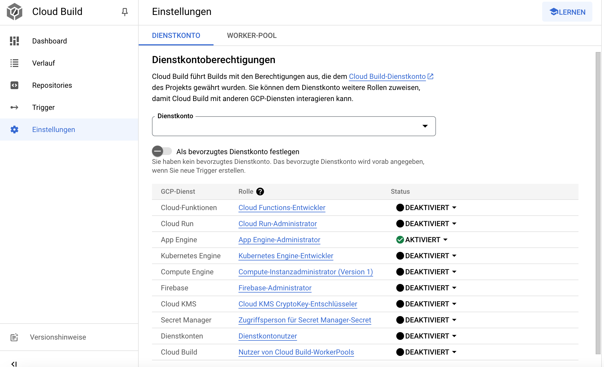
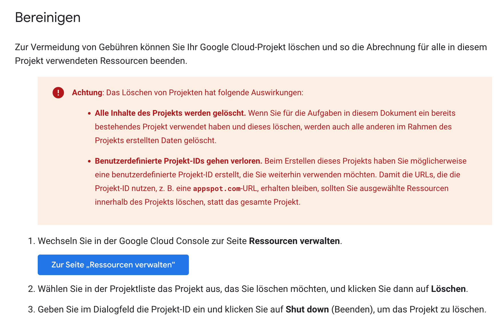
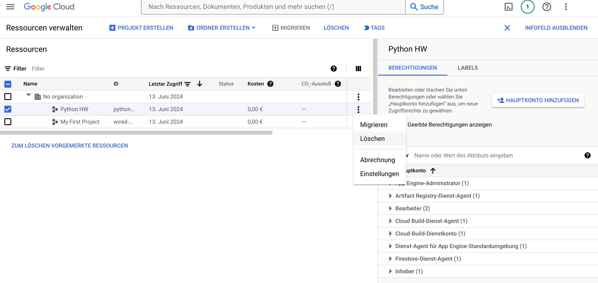

# Übung 4

**Hinweise:**

In den Aufgaben 2-x dieser Übung verwenden wir Docker um Anwendungen zu containerisieren und zu nutzen. Hierzu können Sie Docker Desktop installieren: [https://www.docker.com/products/docker-desktop/](https://www.docker.com/products/docker-desktop/). Hier finden Sie eine Übersicht der verschiedenen Docker-Befehle: [https://docs.docker.com/reference/cli/docker/](https://docs.docker.com/reference/cli/docker/)  

Anmerkung: Starten Sie Docker einmal und gehen Sie in die Einstellungen. Hier können Sie schon mal den Haken bei "Enable Kubernetes" setzen (das brauchen wir zwar jetzt noch nicht, aber zu einem späteren Zeitpunkt).

Jede der folgenden Aufgaben sollte in einem eigenen Projekt realisiert werden.   

Zunächst einmal können Sie das Repository zu Übung 4 über git klonen.  

In diesem Repository finden sie Dockerfiles, die nach folgendem Schema aufgebaut sind:

   ```bash
Dockerfile_n
   ```
Das n ist jeweils eine Ziffer (1,2,3, ...), welche die zugehörige Aufgabe referenziert. Um die Datei in dem jeweiligen Projekt/Repository nutzen zu können, müssen Sie sie folgendermaßen umbenennen:

   ```bash
Dockerfile
   ```

**Aufgabe 1 - Eine Python-App in der Google App Engine realisieren**

Hinweis: Diese Übung ist freiwillig! Sie erfordert zumindest das Anlegen eines kostenlosen Testaccounts unter https://cloud.google.com/. Selbst der kostenlose Test-Account erfordert jedoch die Angabe von z. B. Kreditkarteninformationen. Es liegt in ihrem eigenen Ermessen, ob Sie entsprechende Angaben machen möchten. Wichtig ist in jedem Fall, die angelegten Ressourcen wieder zu löschen (wie, das wird in dieser Anleitung erklärt). Die Verwendung der entsprechenden Dienste erfolgt jedoch unter eigener Verantwortung!

Anmerkung: Wir nutzen hier ein Angebot der Google Cloud exemplarisch. Dies lässt sich bei anderen Cloud-Providern wie AWS, Azure, IBM etc. in ähnlicher Weise nutzen.

Unter folgendem Link finden Sie ein Tutorial, um eine einfache Python-App in der Google App Engine zu realisieren: [https://codelabs.developers.google.com/codelabs/cloud-app-engine-python3#0](https://codelabs.developers.google.com/codelabs/cloud-app-engine-python3#0) 

Anmerkung: Im Tutorial fehlt leider der Hinweis, dass die App Engine Administratorrechte wie untenstehend aktiviert sein müssen. Aktivieren Sie sie zunächst und folgen Sie dann den Anweisungen im Tutorial.



**Wichtig:**
Vergessen Sie nicht am Ende des Tutorials die Ressourcen wieder zu bereinigen, die Sie angelegt haben:




**Aufgabe 2 - Eine Python-App mit Docker containerisieren**

Klonen Sie das Repository zu dieser Übung.  

Erstellen Sie einen Ordner mit folgenden Dateien:

- app.py
- requirements.txt
- Dockerfile (zur Aufgabe 2, siehe Umbenennung oben)

Starten Sie Docker.

Erzeugen Sie ein Docker-Image:

   ```bash
docker build -t wikisearch .
   ```

Starten Sie den Container:
   ```bash
docker run -p 8888:80 wikisearch
   ```
Rufen Sie in ihrem Browser folgende Adresse auf:
   ```bash
http://localhost:8888?wiki=Nürnberg
   ```
Sie sollten nun eine kurze Zusammenfassung zur Stadt Nürnberg sehen.  

Probieren Sie das auch mit anderen Städtenamen aus.  

Prüfen Sie im Docker-Desktop-Dashboard ob der Container läuft.

Prüfen Sie über die Kommandozeile, ob der Container läuft:

   ```bash
docker ps -a

   ```
Quizfrage: Wie vergibt Docker die Default-Namen für seine Container?

Stoppen Sie den Container über das Dashboard oder über die Kommandozeile mit:
   ```bash
docker stop [container_name]

   ```
Finden Sie heraus, wie man einem Container einen selbstgewählten Namen geben kann und starten Sie ihn noch einmal mit einem selbst gewählten Namen.  

Stoppen Sie den Container wie oben angegeben.


**Aufgabe 3 - Eine Java-App mit Docker containerisieren**

Stellen  Sie sicher, dass Sie ein Java Development Kit (JDK) installiert haben [https://www.oracle.com/de/java/technologies/downloads/].

Erstellen Sie einen Ordner mit folgenden Dateien:

- HelloWorld.java
- Dockerfile (zur Aufgabe 3, siehe Umbenennung oben)

Erzeugen Sie ein Docker-Image:
   ```bash
docker build -t hello-world-java .
   ```
Starten Sie den Container mit:
   ```bash
docker run hello-world-java

   ```
Prüfen Sie ob der Container läuft. Was ist der Unterschied zu Aufgabe 2?

**Aufgabe 4 - Artifacts**

Artefakte sind in Deployment-Pipelines Job-Erzeugnisse, die entlang einer Stage-Sequenz weitergereicht werden sollen. Zum Beispiel kann dies bei einem Java-Programm zunächst eine .class Datei sein, die nach einem Build-Job an einen Test-Job weitergereicht wird und zum Ende der Pipeline als .jar Datei ausgegeben werden soll. Diese Artefakte müssen explizit in der Konfigurationsdatei der Pipeline definiert werden.  

Legen Sie zunächst ein neues Projekt/Repository für diese Aufgabe an. Fügen Sie dem Repository den Code aus der Datei aufgabe_4.yml als .gitlab-ci.yml Datei hinzu (siehe Hinweise oben).

a) Führen Sie die Pipeline aus und sehen Sie danach unter "Artifacts" nach, welche Dateien die Pipeline erzeugt hat.  

b) Warum wird für job2 keine Datei angelegt?

c) Ändern Sie die Konfigurationsdatei so, dass auch für job2 die entsprechende Datei erzeugt wird.

**Aufgabe 5 - Branches und Umgebungsvariablen**

GitLab hat eine ganze Reihe von [Umgebungsvariablen](https://docs.gitlab.com/ee/ci/variables/predefined_variables.html) um die Entwicklung in verschiedenen Branches zu steuern. So kann man z. B. steuern, dass ein Build auf dem Master-Branch in die Produktionsumgebung deployt wird, ein Build auf dem Release-Branch in die Staging-Umgebung und alle anderen Branches nur in die Test-Umgebung.

Legen Sie zunächst ein neues Projekt/Repository für diese Aufgabe an. Fügen Sie dem Repository den Code aus der Datei aufgabe_5.yml als .gitlab-ci.yml Datei hinzu (siehe Hinweise oben).

a) Legen Sie folgende Branches in ihrem Projekt an:  

- feature  

- master  

- release

b) Schauen Sie sich die Konfigurationsdatei an. Welche Jobs werden auf welchem Branch ausgeführt?

c) Führen Sie die Pipeline in den unterschiedlichen Branches aus und überprüfen Sie damit ihr Ergebnis aus Aufgabe b) 

d) Ändern Sie die Pipeline so, dass job1 nur im feature Branch ausgeführt wird.

**Aufgabe 6 - (Java-)Programmcode kompilieren und ausführen in einer Pipeline**

Legen Sie zunächst ein neues Projekt/Repository für diese Aufgabe an.   
- Fügen Sie dem Repository den Code aus der Datei aufgabe_6.yml als .gitlab-ci.yml Datei hinzu (siehe Hinweise oben).  
- Fügen Sie dem Repository die Datei HelloWorldBug.java hinzu

a) Wie werden Java-Programme kompiliert und ausgeführt?  
b) Wo finden Sie diese Schritte in der Konfigurationsdatei zu dieser Deployment-Pipeline?  
c) Führen Sie die Pipeline aus. Was passiert? Wo ist der Fehler?  
d) Korrigieren Sie den Fehler und starten Sie die Pipeline erneut. Beide Stages sollten nun erfolgreich passiert werden.  
e) In welchem Fall würde die build-Stage erfolgreich passiert werden, aber die Test-Stage abbrechen? Passen Sie den Quellcode entsprechend an.  

Hinweis: Achten Sie darauf, dass die JDK-Version des GitLab-Servers mit der JDK-Version in der Konfigurationsdatei übereinstimmt.

**Aufgabe 7 - Dependencies in Deployment-Pipelines**

Legen Sie zunächst ein neues Projekt/Repository für diese Aufgabe an.   
- Fügen Sie dem Repository den Code aus der Datei aufgabe_7.yml als .gitlab-ci.yml Datei hinzu (siehe Hinweise oben).  
- Fügen Sie dem Repository die Dateien Film.java und TestFilm.java hinzu.

a) Welche Abhängigkeiten bestehen zwischen diesen beiden Java-Klassen?
b) Führen Sie die Pipeline aus und prüfen Sie, ob sie fehlerfrei durchläuft.

**Aufgabe 8 - Software-Tests in Deployment-Pipelines: Ein Beispiel mit JUnit und Hamcrest**

Legen Sie zunächst ein neues Projekt/Repository für diese Aufgabe an.   
- Fügen Sie dem Repository den Code aus der Datei aufgabe_8.yml als .gitlab-ci.yml Datei hinzu (siehe Hinweise oben).  
- Fügen Sie dem Repository die Dateien FactorialCalculator.java und FactorialCalculatorTest.java hinzu
- Fügen Sie dem Repository die Datei junit-4.12.jar hinzu (Infos zu [JUnit](https://junit.org/junit5/))
- Fügen Sie dem Repository die Datei hamcrest-core-1.3.jar hinzu (Infos zu [Hamcrest](https://hamcrest.org/))

a) Erklären Sie, was hier getestet wird.  
b) Sehen Sie sich die Tests und das Programm an. Was würden Sie als Ausgabe bzw. Test-Ergebnis erwarten?  
c) Testen Sie das Programm, indem Sie die Pipeline ausführen und vergleichen Sie die Ergebnisse mit ihren Einschätzungen aus Aufgabe b).  
